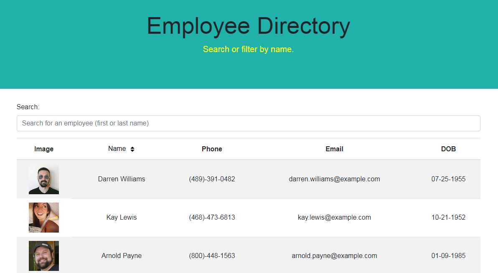

# Employee Directory

## Description:
The Employee Directory app is for internal or external users who want to search for an employee at a company for their phone number, email address or date of birth.  The data list can directly search by first or last name and sort the list alphabetically by name.

## Table of Contents:

* [Installation](#Installation)
* [Usage](#Usage)
* [License](#License)
* [Contributing](#Contributing)
* [Questions](#Questions)

## Installation: 
Copy the link in the browser address bar

[Link] (https://strongmarc.github.io/employee_directory/)

## Usage:

https://drive.google.com/file/d/1waf1sTuvLycQ-yLayba_JhE124F1knX7/view

## License:

Permission is hereby granted, free of charge, to any person obtaining a copy
of this software and associated documentation files (the "Software"), to deal
in the Software without restriction, including without limitation the rights
to use, copy, modify, merge, publish, distribute, sublicense, and/or sell
copies of the Software, and to permit persons to whom the Software is
furnished to do so, subject to the following conditions:

The above copyright notice and this permission notice shall be included in all
copies or substantial portions of the Software.

THE SOFTWARE IS PROVIDED "AS IS", WITHOUT WARRANTY OF ANY KIND, EXPRESS OR
IMPLIED, INCLUDING BUT NOT LIMITED TO THE WARRANTIES OF MERCHANTABILITY,
FITNESS FOR A PARTICULAR PURPOSE AND NONINFRINGEMENT. IN NO EVENT SHALL THE
AUTHORS OR COPYRIGHT HOLDERS BE LIABLE FOR ANY CLAIM, DAMAGES OR OTHER
LIABILITY, WHETHER IN AN ACTION OF CONTRACT, TORT OR OTHERWISE, ARISING FROM,
OUT OF OR IN CONNECTION WITH THE SOFTWARE OR THE USE OR OTHER DEALINGS IN THE
SOFTWARE.

## Contributing:
We pledge to act and interact in ways that contribute to an open, welcoming, diverse, inclusive, and healthy community. 

## Questions:

 marcstrong@yahoo.com
